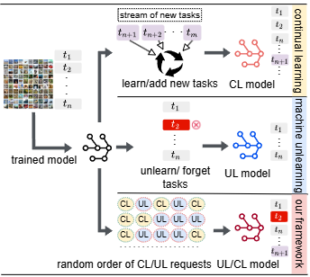
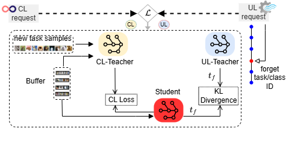

# A Unified Framework for Continual Learning and Machine Unlearning

<a href="https://respailab.github.io/CLMUL/"></a>
<a href="https://arxiv.org/abs/2408.11374"></a>
<a href="https://opensource.org/licenses/BSD-2-Clause"></a>





<br>
<p align="center">

> <a href="https://respailab.github.io/CLMUL/">**A Unified Framework for Continual Learning and Machine Unlearning**</a>
>
<a href="https://www.linkedin.com/in/romit23/" target="_blank">Romit Chatterjee</a>,
<a href="https://www.linkedin.com/in/vikram2000b" target="_blank">Vikram Chundawat</a>,
<a href="https://ayushkumartarun.github.io/" target="_blank">Ayush K Tarun</a>,
<a href="https://www.usf.edu/engineering/cse/people/mali-ankur.aspx" target="_blank">Ankur A Mali</a>,
<a href="https://murarimandal.github.io/" target="_blank">Murari Mandal</a>


>The lack of a consistent framework for continual learning and unlearning makes it difficult to develop flexible models that can learn and forget dynamically. Disjointed techniques are limited in their ability to adapt to new knowledge while removing outdated or sensitive information, making them unsuitable for real-world applications.We compare the isolated continual learning, machine unlearning problems to the unified continual learning-unlearning (CLUL) problem.We propose a controlled knowledge distillation framework for managing continual learning and unlearning operations.
</p>


## Purpose and Ethical Use
This code is shared for educational purposes and is not intended to be used for any harmful or malicious generation, such as the creation of misleading information, harmful content, or the impersonation of others.

## Acknowledgement:


## Citation
If you find this useful for your research, please cite the following:
```bibtex
@misc{chatterjee2024unifiedframeworkcontinuallearning,
      title={A Unified Framework for Continual Learning and Machine Unlearning}, 
      author={Romit Chatterjee and Vikram Chundawat and Ayush Tarun and Ankur Mali and Murari Mandal},
      year={2024},
      eprint={2408.11374},
      archivePrefix={arXiv},
      primaryClass={cs.LG},
      url={https://arxiv.org/abs/2408.11374}, 
}
```

